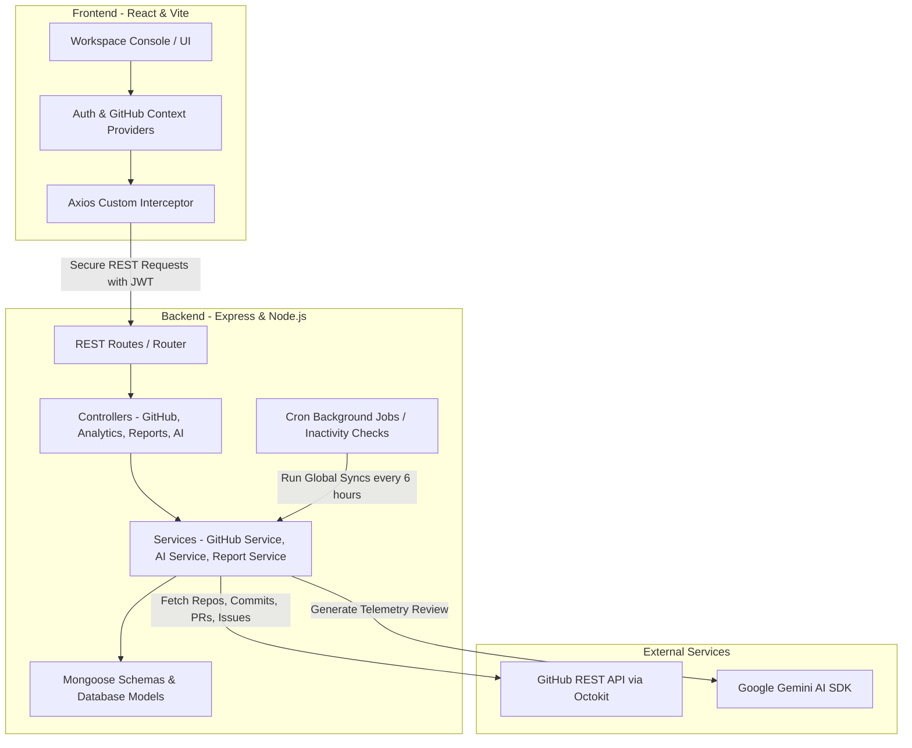

# DevTracker: Developer Telemetry & Productivity Console
### Technical Features & System Architecture Documentation

Welcome to **DevTracker**, a premium developer analytics and telemetry console designed to link user workspaces, aggregate historical GitHub repositories, analyze team delivery cadences, and generate executive diagnostics reports powered by advanced AI.

---

## 1. Core Platform Features

### 📊 Workspace Console (Dashboard)
The Workspace Console acts as a command center, providing high-fidelity visual statistics of repository health and developer cadence:
* **Real-Time Key Performance Indicators (KPIs):**
  * **Total Commits:** Fully counts historical commits synced to the database.
  * **Merged PRs:** Displays pull request merge ratios and team delivery speed.
  * **Active Issues:** Highlights backlog size and ticket resolution metrics.
  * **Engineers Connected:** Tracks unique contributors.
* **Activity Frequency Calendar (Heatmap):** 
  * A 12-week grid mapping commit density using harmonious, contrasted HSL indigo/cyan shading.
  * **Dynamic Date Centering:** Automatically centers the calendar on the repository's latest commit date if the project has been inactive for more than 12 weeks, ensuring the grid looks filled and alive.
* **Commit Velocity Chart:** Visualizes chronological code change speeds using interactive linear-gradient bar charts.
* **Sprint Velocity & Resolution Timelines:** Recharts-powered graphs displaying sprint cadences, branch merge rates, and average resolution times.
* **Activity Feed:** Live chronological scroll of recent commit messages and pull request updates.

### 🤖 AI Diagnostics Engine
Integrates directly with AI services to provide automated telemetric reviews:
* **Productivity Scorecard:** Calculates a normalized score (0–100) based on code deliveries, PR completions, and issue closures.
* **Sprint Cadence Analysis:** Evaluates delivery consistency and rhythm, identifying whether the cadence is a steady daily process or showing irregular spikes.
* **Operational Bottlenecks Bulletin:** Detects blockages such as high backlog ratios, lack of review responses, or individual contributor overload.
* **Actionable Engineering Recommendations:** Offers prioritized, strategic roadmap advice to optimize developer flows.

### 📁 Repository Hub
Allows users to manage and configure their tracked projects:
* **GitHub Repository Workspace List:** Shows linked repositories with stars, forks, and programming language attributes.
* **Repository Selector:** Switch between tracked workspaces instantaneously.
* **Manual Synchronization:** A synchronization trigger with visual loading indicators that makes background fetches of commits, contributors, PRs, and issues.

### 📄 Premium PDF Report Export
A dual-page, highly polished executive PDF report generation system:
* **Zebra-Striped Team Workloads Table:** Renders a clean scoreboard showing names, commits, line counts (additions/deletions), merge rates, productivity scores, and active states.
* **Polished PDF Design System:** Implements clean geometric dividers, corporate title headers, color-coded alert bulletins, and styled footers with absolute page numbering.

### ⚙️ Settings & Security Hub
* **Profile Management:** View connected account names and email metadata.
* **Integration Control:** Securely link or disconnect GitHub account scopes to instantly lock down or refresh telemetries.
* **Security Controls:** Native password hashing and reset triggers.

---

## 2. Technical Architecture & Data Flow

### 🖥️ Frontend Stack (Client)
* **Core & Layout:** **React 18** bootstrapped with **Vite** for optimized build bundles. Custom **Vanilla CSS** provides glassmorphic cards, harmonized HSL color tokens, responsive flex layouts, and hover micro-animations.
* **State Management:** standard React Context API:
  * `AuthContext`: Tracks user authentication status, JWT storage, profile settings, and linked GitHub access scopes.
  * `GitHubContext`: Handles active repository selectors, synced states, and imports.
* **Graphics & Charts:** **Recharts** handles canvas renderings, implementing custom gradients and custom tooltips for premium visual design.
* **Icons:** **Lucide React** for modern UI icons.

### ⚙️ Backend Stack (API Server)
* **Core Runtime:** **Node.js** and **Express.js** in native **ES Module** (`import`/`export`) format.
* **Security Middleware:** **Helmet** to set secure HTTP headers, **CORS** to handle cross-origin routing, and **Express Rate Limit** to block high-frequency server requests.
* **Authentication:** **JSON Web Tokens (JWT)** verify user permissions and secure all metrics-fetching endpoints. User passwords are encrypted using **Bcrypt**.

### 🗄️ Database & Schemas (MongoDB)
All data records are managed using **Mongoose** schemas defining strict relational models:
* `User`: Stores credentials, linked GitHub username, avatar, and encrypted OAuth tokens.
* `Repository`: Keeps repo titles, sync status timestamps, and cached contributors lists.
* `Commit`: Indexes commits by unique git `sha` values, caching messages, contributor names, additions, and deletions.
* `PullRequest`: Tracks pull requests with PR numbers, statuses (`open`, `closed`, `merged`), creation times, and merge dates.
* `Issue`: Tracks active tickets, label arrays, assignees, and resolution dates.
* `AIReport`: Caches full-length AI text analyses, bottleneck bullet points, recommendations, and productivity indexes.

---

## 3. How the Synchronization Works

When you link a repository or click **Sync Stats**, the following transactional workflow is executed:

1. **Client Request:** The frontend makes a `POST` request to `/api/github/sync/:repoId`, signed with the user's JWT.
2. **GitHub API Query:** The backend fetches user credentials, constructs a custom **Octokit Client** utilizing the user's GitHub Token, and queries the GitHub API:
   * Fetches the contributor list.
   * Fetches commits (lists headers first, then fetches detailed structures in parallel to extract additions/deletions stats up to 180 days).
   * Fetches all Pull Requests (both open and closed).
   * Fetches all Repository Issues.
3. **Database Bulk Writes (Upserts):** To maximize speed and avoid database locks, the backend executes **bulk upserts** using `bulkWrite`:
   * Matches commits by unique `sha` values.
   * Matches PRs and Issues by repo ID and issue/PR number.
   * Updates only fields that changed (preventing unnecessary document writes).
4. **Metadata Updates:** The repository document's `lastSynced` field is updated with the current timestamp.
5. **State Refetching:** The frontend receives a `200 OK` response, triggers a background reload of analytics contexts, and updates charts in real time.
