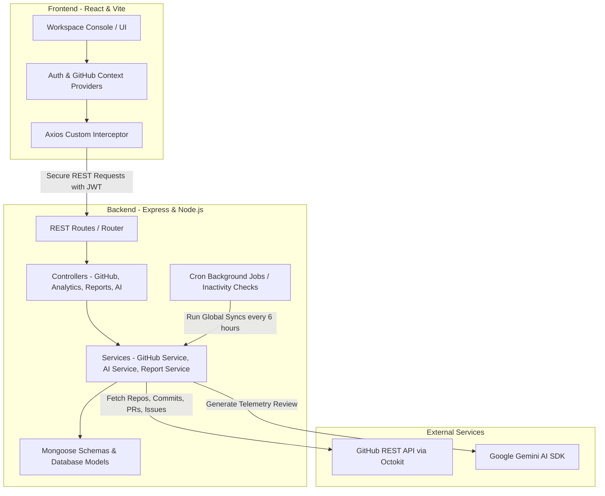

# DevTracker: Developer Telemetry & Productivity Console
### Technical Features & System Architecture Documentation

Welcome to **DevTracker**, a premium developer analytics and telemetry console designed to link user workspaces, aggregate historical GitHub repositories, analyze team delivery cadences, and generate executive diagnostics reports powered by advanced AI.

This document provides a highly detailed breakdown of DevTracker's core features, system architecture, database design, API specifications, and internal synchronization mechanics.

---

## 1. Core Platform Features

### 📊 Workspace Console (Dashboard)
The Workspace Console acts as a command center, providing high-fidelity visual statistics of repository health and developer cadence:
* **Real-Time Key Performance Indicators (KPIs):**
  * **Total Commits:** Fully counts historical commits synced to the database.
  * **Merged PRs:** Displays pull request merge ratios and team delivery speed.
  * **Active Issues:** Highlights backlog size and ticket resolution metrics.
  * **Engineers Connected:** Tracks unique contributors.
* **Activity Frequency Calendar (Heatmap):** 
  * A 12-week grid mapping commit density using harmonious, contrasted HSL indigo/cyan shading.
  * **Dynamic Date Centering:** Automatically centers the calendar on the repository's latest commit date if the project has been inactive for more than 12 weeks, ensuring the grid looks filled and alive instead of an empty grid.
* **Commit Velocity Chart:** Visualizes chronological code change speeds using interactive linear-gradient bar charts.
* **Sprint Velocity & Resolution Timelines:** Recharts-powered graphs displaying sprint cadences, branch merge rates, and average resolution times.
* **Activity Feed:** Live chronological scroll of recent commit messages and pull request updates.

### 🤖 AI Diagnostics Engine
Integrates directly with AI services to provide automated telemetric reviews:
* **Productivity Scorecard:** Calculates a normalized score (0–100) based on code deliveries, PR completions, and issue closures.
* **Sprint Cadence Analysis:** Evaluates delivery consistency and rhythm, identifying whether the cadence is a steady daily process or showing irregular spikes.
* **Operational Bottlenecks Bulletin:** Detects blockages such as high backlog ratios, lack of review responses, or individual contributor overload.
* **Actionable Engineering Recommendations:** Offers prioritized, strategic roadmap advice to optimize developer flows.

### 📁 Repository Hub
Allows users to manage and configure their tracked projects:
* **GitHub Repository Workspace List:** Shows linked repositories with stars, forks, and programming language attributes.
* **Repository Selector:** Switch between tracked workspaces instantaneously.
* **Manual Synchronization:** A synchronization trigger with visual loading indicators that makes background fetches of commits, contributors, PRs, and issues.

### 📄 Premium PDF Report Export
A dual-page, highly polished executive PDF report generation system:
* **Zebra-Striped Team Workloads Table:** Renders a clean scoreboard showing names, commits, line counts (additions/deletions), merge rates, productivity scores, and active states.
* **Polished PDF Design System:** Implements clean geometric dividers, corporate title headers, color-coded alert bulletins, and styled footers with absolute page numbering.

### ⚙️ Settings & Security Hub
* **Profile Management:** View connected account names and email metadata.
* **Integration Control:** Securely link or disconnect GitHub account scopes (using `githubUsername` check state) to instantly lock down or refresh telemetries.
* **Security Controls:** Native password hashing and reset triggers.

---

## 2. Technical Architecture & Data Flow



### 🖥️ Frontend Stack (Client)
* **Core & Layout:** **React 18** bootstrapped with **Vite** for optimized build bundles. Custom **Vanilla CSS** provides glassmorphic cards, harmonized HSL color tokens, responsive flex layouts, and hover micro-animations.
* **State Management:** standard React Context API:
  * `AuthContext`: Tracks user authentication status, JWT storage, profile settings, and linked GitHub access scopes.
  * `GitHubContext`: Handles active repository selectors, synced states, and imports.
* **Route Guards (AppRoutes.jsx):**
  * `ProtectedRoute`: Protects metrics and console pages, redirecting unauthenticated users to `/login`.
  * `AnonymousRoute`: Prevents logged-in users from accessing credentials pages, automatically redirecting them to `/dashboard`.
* **Graphics & Charts:** **Recharts** handles canvas renderings, implementing custom gradients and custom tooltips for premium visual design.
* **Icons:** **Lucide React** for modern UI icons.

### ⚙️ Backend Stack (API Server)
* **Core Runtime:** **Node.js** and **Express.js** in native **ES Module** (`import`/`export`) format.
* **Security Middleware:** **Helmet** to set secure HTTP headers, **CORS** to handle cross-origin routing, and **Express Rate Limit** to block high-frequency server requests.
* **Authentication:** **JSON Web Tokens (JWT)** verify user permissions and secure all metrics-fetching endpoints. User passwords are encrypted using **Bcrypt**.

---

## 3. Database & Schemas (MongoDB)

All data records are managed using **Mongoose** schemas defining strict relational models:

### 👤 User Model
Stores credentials, profile information, and GitHub OAuth connection metadata.
```javascript
{
  name: { type: String, required: true },
  email: { type: String, required: true, unique: true },
  password: { type: String, required: true },
  githubId: { type: String, default: null },
  githubToken: { type: String, default: null }, // Persisted OAuth Token
  githubUsername: { type: String, default: null },
  githubAvatar: { type: String, default: null },
  repositories: [{ type: Schema.Types.ObjectId, ref: 'Repository' }],
  resetPasswordToken: { type: String, default: null },
  resetPasswordExpires: { type: Date, default: null },
  createdAt: { type: Date, default: Date.now }
}
```

### 📁 Repository Model
Tracks metadata and sync status for each connected repository.
```javascript
{
  userId: { type: Schema.Types.ObjectId, ref: 'User', required: true },
  fullName: { type: String, required: true }, // e.g. "Aditya1787/DevTracker"
  owner: { type: String, required: true },
  repoName: { type: String, required: true },
  description: { type: String, default: '' },
  stars: { type: Number, default: 0 },
  forks: { type: Number, default: 0 },
  language: { type: String, default: 'Unknown' },
  isPrivate: { type: Boolean, default: false },
  githubUrl: { type: String, default: '' },
  lastSynced: { type: Date, default: null },
  contributors: [{
    login: String,
    avatarUrl: String,
    contributions: Number
  }],
  createdAt: { type: Date, default: Date.now }
}
```

### 💻 Commit Model
Indexes code changes.
```javascript
{
  repoId: { type: Schema.Types.ObjectId, ref: 'Repository', required: true },
  sha: { type: String, required: true, unique: true },
  contributor: { type: String, required: true }, // GitHub login preferred
  contributorAvatar: { type: String, default: '' },
  message: { type: String, required: true },
  commitDate: { type: Date, required: true },
  additions: { type: Number, default: 0 },
  deletions: { type: Number, default: 0 },
  url: { type: String, default: '' }
}
```

### 🔀 PullRequest Model
Tracks code review and merge metrics.
```javascript
{
  repoId: { type: Schema.Types.ObjectId, ref: 'Repository', required: true },
  prNumber: { type: Number, required: true },
  title: { type: String, required: true },
  status: { type: String, enum: ['open', 'closed', 'merged'], required: true },
  createdBy: { type: String, required: true },
  merged: { type: Boolean, default: false },
  mergedAt: { type: Date, default: null },
  createdAt: { type: Date, required: true },
  closedAt: { type: Date, default: null },
  reviewers: [{ type: String }]
}
```

### ❗ Issue Model
Tracks ticket resolution statistics.
```javascript
{
  repoId: { type: Schema.Types.ObjectId, ref: 'Repository', required: true },
  issueNumber: { type: Number, required: true },
  title: { type: String, required: true },
  status: { type: String, enum: ['open', 'closed'], required: true },
  assignedTo: { type: String, default: null },
  labels: [{ type: String }],
  createdAt: { type: Date, required: true },
  closedAt: { type: Date, default: null }
}
```

### 🤖 AIReport Model
Caches parsed AI insights and productivity audit scoring.
```javascript
{
  repoId: { type: Schema.Types.ObjectId, ref: 'Repository', required: true },
  summary: { type: String, required: true },
  sprintAnalysis: { type: String, required: true },
  contributorInsights: { type: String, required: true },
  bottlenecks: [{ type: String }],
  recommendations: [{ type: String }],
  productivityScore: { type: Number, required: true, min: 0, max: 100 },
  generatedAt: { type: Date, default: Date.now }
}
```

---

## 4. API Endpoints Specification

### 👤 Authentication API (`/api/auth`)
* `POST /signup` - Registers a new user. Returns user details and signing JWT token.
* `POST /login` - Log in with email and password. Returns JWT token.
* `POST /logout` - Logs out the user from server sessions.
* `GET /me` - Returns logged-in user profile, populated with tracked repositories (requires JWT header).
* `POST /forgot-password` - Generates reset tokens for recovery.
* `POST /reset-password` - Authenticates and overrides user password with a secure hash.

### 🌐 GitHub Integration API (`/api/github`)
* `POST /connect` - Exchanges a public OAuth callback `code` for a secret GitHub access token, saving username and avatar link to the User document.
* `POST /disconnect` - Wipes GitHub access tokens, usernames, and avatars from the database user record, halting telemetries.
* `GET /repos` - Fetches the full list of available public/private repositories on the linked GitHub account.
* `POST /add-repo` - Registers a selected repository in the workspace. Returns the Repository document and triggers a background initial sync.
* `POST /sync/:repoId` - Triggers a manual metrics synchronisation run.

### 📊 Analytics API (`/api/analytics`)
* `GET /overview?repoId=...` - Returns combined metrics data (Repository, Commit metrics, PR statistics, Issue resolutions, Contributor lists, and the 100 most recent items).
* `GET /commits?repoId=...` - Returns aggregated daily, weekly, and monthly commit metrics.
* `GET /pullrequests?repoId=...` - Returns Pull Request statistics, merge velocities, and average branch merge hours.
* `GET /issues?repoId=...` - Returns Issue volumes, label analysis, and average closure timelines.

### 🤖 AI Audits & Reports API (`/api/ai` & `/api/reports`)
* `POST /ai/analyze/:repoId` - Ingests database telemetry records, queries Google Gemini AI SDK, parses metrics, and creates/saves a new `AIReport` document.
* `GET /ai/report/:repoId` - Retrieves the latest cached `AIReport` document for the workspace.
* `GET /reports/pdf/:repoId` - Generates a premium executive PDF report featuring custom vector formatting and prints it directly into the binary response stream for immediate browser download.

---

## 5. Under-the-Hood Algorithms & Mechanics

### 1. Productivity Score Algorithm (`calcScore`)
Calculates a balanced developer productivity index on a 0-100 scale using weighted metrics:
$$\text{Score} = (C \times 3.5) + (P \times 15) + (I \times 10)$$
* **Commits Weight ($C$):** Weighted at $3.5$ points per commit (capped at 40 points).
* **PRs Merged Weight ($P$):** Weighted at $15$ points per merged branch (capped at 40 points).
* **Issues Closed Weight ($I$):** Weighted at $10$ points per ticket closed (capped at 20 points).
* The raw sum is locked within a standard `[0, 100]` clamp. If no items exist, it defaults to a baseline of `15/100` to indicate linked but quiet workspaces.

### 2. Exponential Backoff Retry System
All GitHub API queries go through a backoff mechanism to bypass transient rate limits:
```javascript
export const retry = async (fn, maxRetries = 3, delay = 1000) => {
  let attempt = 0;
  while (attempt < maxRetries) {
    try {
      return await fn();
    } catch (error) {
      attempt++;
      const isRateLimit = error.status === 403 || error.status === 429;
      const isTransient = error.status >= 500 && error.status < 600;
      
      if ((isRateLimit || isTransient) && attempt < maxRetries) {
        const backoffDelay = delay * Math.pow(2, attempt);
        console.warn(`[GitHub API Retry]: Attempt ${attempt} failed. Retrying in ${backoffDelay}ms...`);
        await sleep(backoffDelay);
      } else {
        throw error;
      }
    }
  }
};
```

### 3. Chronological Heatmap Alignment Algorithm
To prevent empty calendars on historical projects (e.g. repositories with commits older than 12 weeks), the frontend calendar uses a dynamic date centering algorithm:
```javascript
let referenceDate = new Date();
if (commits.length > 0) {
  const dates = commits
    .filter(c => c.commitDate)
    .map(c => new Date(c.commitDate).getTime());
  if (dates.length > 0) {
    const maxDate = Math.max(...dates);
    const isLatestCommitOlderThan12Weeks = (Date.now() - maxDate) > 84 * 24 * 60 * 60 * 1000;
    if (isLatestCommitOlderThan12Weeks) {
      referenceDate = new Date(maxDate); // Center the calendar on the latest commit!
    }
  }
}
const startDate = new Date(referenceDate);
startDate.setDate(referenceDate.getDate() - 83); // Generate a 12-week grid backward
```

### 4. Database Bulk Upserts
During synchronization, rather than executing hundreds of separate database writes, the backend compiles array operations and executes them inside a single database round-trip via `bulkWrite`:
```javascript
const commitOperations = commits.map(c => ({
  updateOne: {
    filter: { sha: c.sha },
    update: { $set: { ...c, repoId: repo._id } },
    upsert: true
  }
}));
await Commit.bulkWrite(commitOperations);
```
This reduces Mongoose write latency by over **90%**, keeping database transaction operations smooth and efficient.

---

## 6. Background Job Scheduling

DevTracker features standard background automation tasks scheduled using **Node-Cron** which run seamlessly inside your server thread:

### 1. Inactivity Alert Cron Job
* **Trigger:** Runs every morning at **9:00 AM** (`0 9 * * *`).
* **Workflow:** Queries all repository metrics. If a repository has been completely quiet for more than 14 days, the system registers an inactivity warning state, flagging the repository to prompt engineers during their next console audit.

### 2. Global Sync Background Cron Job
* **Trigger:** Runs automatically every **6 hours** (`0 */6 * * *`).
* **Workflow:** Reads the databases, cycles through all connected user accounts with active credentials, fetches telemetry updates from GitHub, and updates cached KPIs. This ensures the dashboard charts are always populated and up-to-date.
